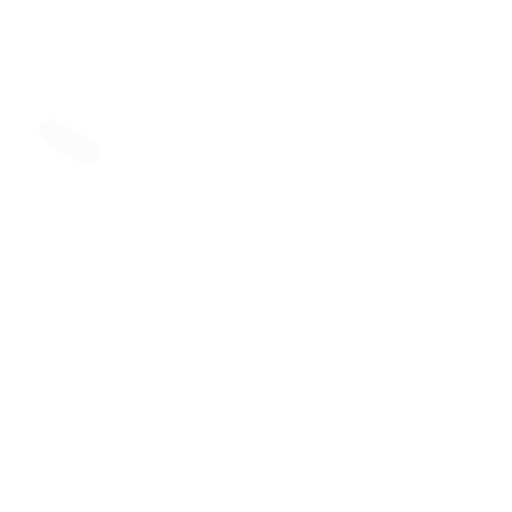

<a id="readme-top"></a>

<!-- PROJECT LOGO -->
<br />
<div align="center">
  <a href="https://github.com/Tarif24/Mini_Projects_Website_React">
    
  </a>

  <h3 align="center">Mini Projects</h3>

  <p align="center">
    A site for my mini projects
    <br />
    <br />
    <br />
    <a href="https://mini-projects.tarifmohammad.com/">View Demo</a>
    &middot;
    <a href="https://github.com/Tarif24/Mini_Projects_Website_React/issues/new">Report Bug</a>
  </p>
</div>

<!-- TABLE OF CONTENTS -->
<details>
  <summary>Table of Contents</summary>
  <ol>
    <li>
      <a href="#about-the-project">About The Project</a>
      <ul>
        <li><a href="#built-with">Built With</a></li>
      </ul>
    </li>
    <li>
      <a href="#getting-started">Getting Started</a>
      <ul>
        <li><a href="#prerequisites">Prerequisites</a></li>
        <li><a href="#installation">Installation</a></li>
      </ul>
    </li>
    <li><a href="#contact">Contact</a></li>
    <li><a href="#acknowledgments">Acknowledgments</a></li>
  </ol>
</details>

<!-- ABOUT THE PROJECT -->

## About The Project

[![Product Name Screen Shot][product-screenshot]][Live-Demo]

This project is just an combination of many small projects. Any time I had an idea that could make a cool project but it dident have enough content to be its own full fledged site, I would put it in this site and this was my way out of tutorial hell. This site is more of like a playground for me to test out diffrent ideas that can be features of other sites or just a place to test out cool new things I learned. Each and everyone of these projects taught me alot about web dev.

<p align="right">(<a href="#readme-top">back to top</a>)</p>

### Built With

These are all of the tools used for this project

-   React
-   Tailwind CSS

<p align="right">(<a href="#readme-top">back to top</a>)</p>

<!-- GETTING STARTED -->

## Getting Started

This is only if you would like to replicate or make a project similar to this

### Prerequisites

-   Install the code editor of choice (mine was VS CODE)

### Installation

1. Clone the repo
    ```sh
    git clone https://github.com/Tarif24/Mini_Projects_Website_React.git
    ```
    or just copy the zip file from this repo
2. Install NPM packages
    ```sh
    npm install
    ```
3. Then your all good to go and can start editing the files

<p align="right">(<a href="#readme-top">back to top</a>)</p>

<!-- CONTACT -->

## Contact

Tarif Mohammad - [@GitHub](https://github.com/Tarif24) - [@Linkedin](https://www.linkedin.com/in/tarif-mohammad/) - Tarif24@hotmail.com

Project Link: [https://github.com/Tarif24/Mini_Projects_Website_React](https://github.com/Tarif24/Mini_Projects_Website_React)

Live Link: [https://mini-projects.tarifmohammad.com/][Live-Demo]

<p align="right">(<a href="#readme-top">back to top</a>)</p>

<!-- ACKNOWLEDGMENTS -->

## Acknowledgments

This is a list of recources that i found helpful and would like to give credit too

-   [HTML Documentation](https://developer.mozilla.org/en-US/docs/Web/HTML)
-   [Tailwind CSS Documentation](https://tailwindcss.com/)
-   [JavaScript Documentation](https://developer.mozilla.org/en-US/docs/Web/JavaScript)
-   [React Documentation](https://react.dev/)
-   [OpenAI API Documentation](https://platform.openai.com/docs/overview)

<p align="right">(<a href="#readme-top">back to top</a>)</p>

<!-- MARKDOWN LINKS & IMAGES -->
<!-- https://www.markdownguide.org/basic-syntax/#reference-style-links -->

[product-screenshot]: src/assets/readme-image.png
[Live-Demo]: https://mini-projects.tarifmohammad.com/
